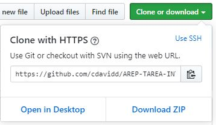
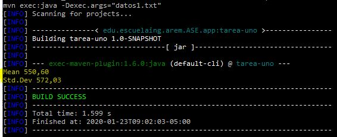

# AREP-Taller-1

Este programa implementa una linkedlist propia que se utilizara para calcular la media y desviación estándar de los datos a procesar.

## Empezando

Estas instrucciones ofrecerán una guía de como utilizar la copia del programa que usted podrá tener en su maquina local para fines de desarrollo y prueba.

### Prerrequisitos

**Java**

Se necesitara del java JDK 1.8, para verificar que se tiene abriremos nuestra terminal o consola de comando y ejecutaremos el siguiente comando:

```
java -version
java version "1.8.0_221"
Java(TM) SE Runtime Environment (build 1.8.0_221-b11)
Java HotSpot(TM) 64-Bit Server VM (build 25.221-b11, mixed mode)
```

En caso de no tenerlo se podra descargar de [java](https://www.oracle.com/technetwork/java/javase/downloads/jdk8-downloads-2133151.html)

**Maven**

Se necesitara de Maven para ejecutar el programa, para eso se verificara si se tiene con `mvn -v` en caso de no tenerlo se podrá hacer [aqui](https://maven.apache.org/install.html)

### Instalación

Para la instalación de nuestro programa, lo podremos hacer dándole en el botón "Clone or download"



Podremos copiar la URL y desde consola ejecutar el siguiente comando `git clone <URL>` o le damos en la opción Download ZIP

**Ejecución**

Para la ejecución del programa entraremos en la carpeta descargada o clonada _AREP-TAREA-INTRODUCCION/trabajo_, ya en esta ubicación desde consola ejecutaremos el siguiente comando: `mvn exec:java -Dexec.args="<archivo.txt>"`


## Ejecutando las pruebas

Para ejecutar la pruebas se realizara mediante el siguiente comando `mvn test`

- Ejemplo de prueba.

```java
	@Test
	public  void  testMean(){
		DecimalFormat  df = new  DecimalFormat("#.00");
		LinkedList<Double> datos = new  LinkedList<Double>();
		datos.add(15.0);
		datos.add(69.9);
		datos.add(6.5);
		datos.add(22.4);
		datos.add(28.4);
		datos.add(65.9);
		datos.add(19.4);
		datos.add(198.7);
		datos.add(38.8);
		datos.add(138.2);
		double  mean = Estadistica.mean(datos);
		String  res = df.format(mean);
		double  r = 60.32;
		String  res1 = df.format(r);
		assertEquals(res1,res);
	}
```

## Autores

- Cristian López

## Licencia

- GNU General Public License v3.0
